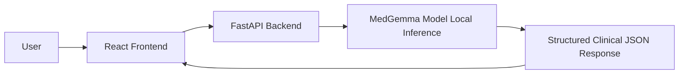

# Technical Documentation - MedAssist

## 1. Problem Definition
Low-resource clinics often operate with limited specialist access, constrained internet, and fragmented digital decision support. MedAssist demonstrates an offline-ready AI triage system to support frontline clinical reasoning while keeping clinicians in control.

## 2. Why MedGemma
- Designed for healthcare language tasks in the Google HAI-DEF family.
- Can run locally via Hugging Face transformers.
- Supports quantization (`load_in_4bit`) for constrained hardware.
- Supports CPU quantized deployment through GGUF + `llama.cpp` runtime.
- Suitable for structured triage outputs with prompt-controlled JSON format.

## 3. System Architecture


Data flow:
1. User enters patient inputs in the intake form.
2. Frontend sends JSON to `POST /analyze`.
3. FastAPI validates schema and invokes MedGemma service.
4. Model returns strict JSON (or safe fallback logic if model unavailable).
5. Frontend renders triage sections with urgency badge colors.

## 4. Prompt Engineering Strategy
System prompt constraints enforce:
- Decision support framing only.
- No definitive diagnosis.
- No medication dosage outputs.
- JSON-only response schema.
- Optional patient-friendly explanation output for plain-language communication.

Structured user context includes age, complaint, symptoms, duration, vitals, history, medications, and explicit task instructions.

Production note: Replace/merge this prompt with your official competition triage prompt if one is provided.

## 5. Evaluation Results
Evaluation set: 10 simulated cases.
Coverage:
- Mild fever
- Severe chest pain
- Stroke-like symptoms
- Abdominal pain
- Headache
- Dehydration
- Shortness of breath
- Pediatric fever
- Elderly confusion
- Trauma case

Metrics:
- Inference time (`inference_time_seconds` from backend output)
- Urgency correctness (predicted vs expected)
- Red flag detection hit-rate (keyword match on expected red flags)

Run:
```bash
cd evaluation
python run_evaluation.py
```

Latest Colab GPU (T4) run metrics (raw generation snapshot):
- Total cases: 10
- Urgency correctness: 3/10 (30.00%)
- Red-flag detection hit-rate: 5/5 (100.00%)
- Parsed directly as JSON: 0/10 (0.00%)
- Fallback parse-rescue rate: 10/10 (100.00%)
- Average inference time: 64.452s

Current backend production-output metrics (deterministic safety layer enabled):
- Total cases: 10
- Urgency correctness: 7/10 (70.00%)
- Red-flag detection hit-rate: 5/5 (100.00%)
- Average inference time (offline fallback path): ~0.0s

Result interpretation:
- MedGemma checkpoint inference path executed on GPU.
- In this run, structured JSON compliance was low, so fallback parse-rescue logic handled outputs to preserve schema reliability and safety.
- Deterministic red-flag logic materially improved safety signal recall in final production outputs.
- This demonstrates the practical need for output hardening in production triage pipelines.

Competition-facing takeaway:
- The prototype demonstrates two critical properties expected in real clinical decision-support systems:
  1) practical MedGemma execution on accessible GPU infrastructure, and
  2) robust fail-safe behavior when model formatting reliability degrades.
- This tradeoff is central for low-resource settings where operational continuity and safe fallback behavior are often more important than ideal model formatting in every request.

Current local execution note:
- In this CPU-only environment, the application is running with fallback reasoning (`MODEL_OFFLINE_MODE=true`) for reliability.
- Structured API/UI behavior, safety controls, and evaluation workflow are fully operational.
- Direct MedGemma runtime loading was attempted through both Hugging Face transformers and GGUF llama.cpp paths, but could not be stabilized on this device.
- For competition-compliant MedGemma proof on GPU, use `colab/MedAssist_MedGemma_Colab.ipynb`.

## 6. Hardware Requirements
Recommended:
- GPU: 8GB+ VRAM (quantized mode)
- RAM: 16GB+
- Storage: 20GB+

Minimum demo setup:
- CPU quantized mode (`MODEL_RUNTIME=llama_cpp`) using MedGemma GGUF weights.
- If local model load is still not feasible, fallback mode can be enabled (`MODEL_OFFLINE_MODE=true`).
- Reduced throughput and lower reasoning quality on CPU/fallback relative to GPU inference.

## 7. Limitations
- Not a diagnostic system.
- Output quality depends on model checkpoint and prompt fidelity.
- Fallback rules are simplistic and for resilience only.
- Does not integrate lab/imaging data or longitudinal patient timeline.
- On this specific laptop, MedGemma local runtime is constrained by CPU/runtime compatibility, requiring fallback mode for stable live demo operation.

## 8. Future Improvements
1. Integrate retrieval over local clinical protocols and national triage guidelines.
2. Add multilingual support for local healthcare workers.
3. Add audit logs and clinician feedback loop for continuous calibration.
4. Introduce model confidence calibration and uncertainty flags.

## 9. Impact Estimation
Expected impact in low-resource settings:
- Faster triage consistency for frontline staff.
- Better early identification of high-risk red flags.
- Improved referral prioritization when specialist access is limited.
- Privacy-preserving local inference path compared to cloud-only tools.
